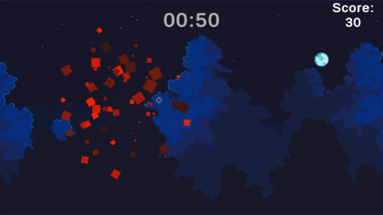
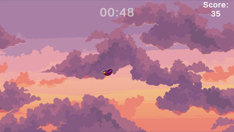
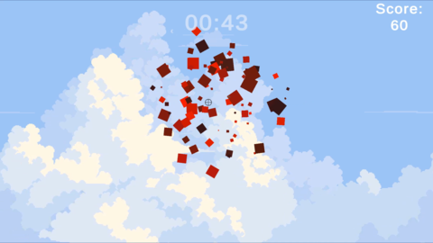
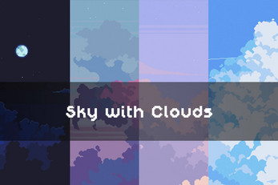

# Birds Shooting Training 

## Description

This is a small project developed in Unity to hone my skills in Unity and C# programming. The objective of the game is to shoot birds and achieve the highest score possible. Additionally, the game features a parallax effect to create a more dynamic and engaging visual experience.

### Screenshots:

<p align="center">
    
    
    
</p>

## Tech stack

<p align="left">
    
    
    
</p>

## Files description

| FILE            | DESCRIPTION                                                                                               |
| :-------------: | --------------------------------------------------------------------------------------------------------- |
| Assets          | Contains project assets like 2D sprites, scripts, sounds, textures etc.                                   |
| Packages        | May include Unity packages with pre-built code and resources for specific functionalities.                |
| ProjectSettings | Stores project-specific configuration files (import settings, platform settings, quality settings, etc.). |
| resources       | Contains additional materials for the README file.                                                        |
| .gitignore      | Specifies files and folders to be ignored by Git version control.                                         |
| README.md       | Information about the project.                                                             |

## Assets

<p align="center">
    <a href="https://free-game-assets.itch.io/free-sky-with-clouds-background-pixel-art-set" target="_blank">
        
    </a>
    <br>
    By <a href="https://free-game-assets.itch.io/" target="_blank">CRAFTPIX</a> from <a href="https://itch.io/" target="_blank">itch.io</a>
</p>

## Installation

### Clone the repository and run from Unity

1. Clone the repository:
    - Open your preferred terminal.
    - Navigate to the directory where you want to clone the repository.
    - Run the following command:
```
git clone https://github.com/SpStigma/Unity-2D-BirdsShootingTraining.git
```

2. Open in Unity:
    - Launch Unity Hub.
    - Click on "Add" and select the folder where you cloned the repository.
    - Once added, click on the project to open it in Unity.

3. Run from Unity:
    - In the Unity Editor, navigate to the "Assets" folder.
    - Open the "Scenes" folder.
    - Double-click on the "Title Scene" to open it.
    - Click the "Play" button at the top to run the game in the Unity Editor.

### Play on Itchio
1- Click on  <a href="https://spstigma.itch.io/shooting-birds" target="_blank"> Game on itchio </a>

## Thanks

A heartfelt thank you to all contributors who provided freely licensed graphics and music for our project.


## Author
    Me XD: Github: [@SpStigma](https://github.com/SpStigma)